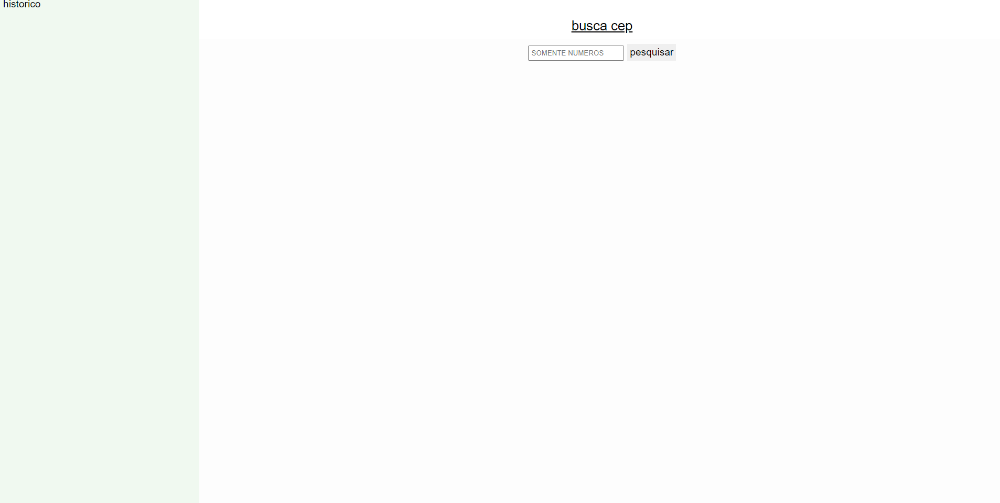
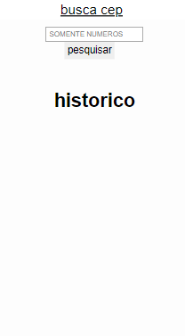

# buscado cep

<a href="https://vilmar-moreira-souza.github.io/buscador-cep/" target="blank">visualizar</a>

<h2>desktop</h2>

<h2>mobile</h2>

 

<h3>sobre a aplicação</h3>

essa aplicação é um pagina para procura de cep atraves do codigo(numeros), usando a  <a href="https://docs.awesomeapi.com.br/api-cep">api awesomeap </a> .

 <a href="https://vilmar-moreira-souza.github.io/buscador-cep/" target="blank">visualizar </a>
 

<h3>ideias para implementar</h3>
 <li>melhorar o design</li>
<li> adicionar busca pelo nome da rua</li>
<li>mostrar formato esperado (00000-000), enquanto usuario digita </li>
<li>limitar o numero de caracteres digitados, modelo esperado (00000000)</li>
<li> mais...</li>

<h3>bugs e problemas</h3>
<li>...</li>